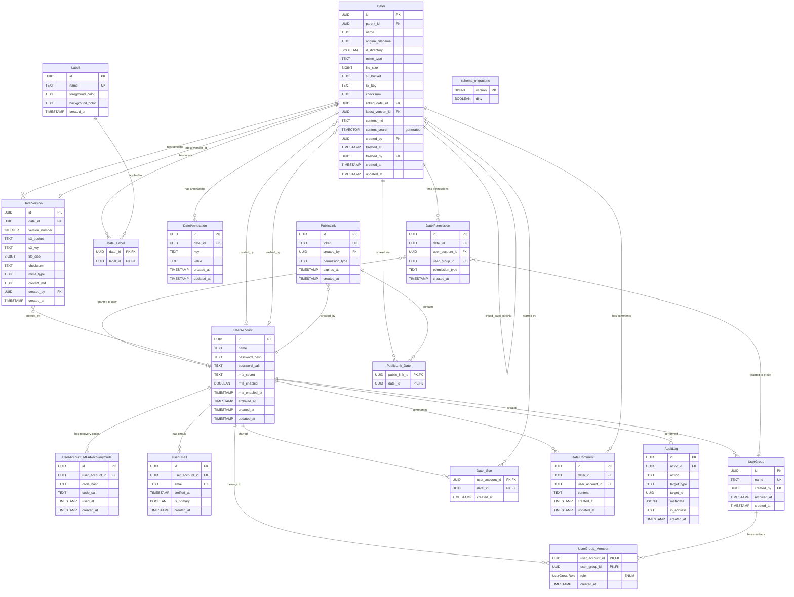

# Datei Database Schema

## ER Diagram



## ASCII Schema

```
┌──────────────────────────────────────────┐       ┌──────────────────────────────────────┐
│ UserAccount                              │       │ UserGroup                            │
├──────────────────────────────────────────┤       ├──────────────────────────────────────┤
│ id             UUID           PK         │       │ id             UUID           PK     │
│ name           TEXT           NOT NULL   │       │ name           TEXT           UNIQUE  │
│ password_hash  TEXT           NOT NULL   │       │ created_by     UUID           FK     │
│ password_salt  TEXT           NOT NULL   │       │ archived_at    TIMESTAMP             │
│ mfa_secret     TEXT                      │       │ created_at     TIMESTAMP             │
│ mfa_enabled    BOOLEAN  DEFAULT false    │       └──────────┬───────────────────────────┘
│ mfa_enabled_at TIMESTAMP                 │                  │
│ archived_at    TIMESTAMP                 │                  │
│ created_at     TIMESTAMP                 │                  │
│ updated_at     TIMESTAMP                 │                  │
│ CHECK: mfa_enabled => mfa_secret set     │                  │
└──┬──────┬───────┬────────────────────────┘                  │
   │      │       │                                           │
   │      │       │  ┌─────────────────────────────────────────────┐
   │      │       │  │ UserAccount_MFARecoveryCode                 │
   │      │       │  ├─────────────────────────────────────────────┤
   │      │       └─>│ id               UUID       PK              │
   │      │          │ user_account_id  UUID       FK              │
   │      │          │ code_hash        TEXT       NOT NULL        │
   │      │          │ code_salt        TEXT       NOT NULL        │
   │      │          │ used_at          TIMESTAMP                  │
   │      │          │ created_at       TIMESTAMP                  │
   │      │          └─────────────────────────────────────────────┘
   │      │                                                   │
   │      │  ┌────────────────────────────────────────────────┐│
   │      │  │ UserGroup_Member                               ││
   │      │  ├────────────────────────────────────────────────┤│
   │      │  │ user_account_id  UUID  PK,FK ──────────────────┘│
   │      │  │ user_group_id    UUID  PK,FK ───────────────────┘
   │      │  │ role             UserGroupRole  DEFAULT 'member'│
   │      │  │ created_at       TIMESTAMP                      │
   │      │  └─────────────────────────────────────────────────┘
   │      │
   │      │  ┌────────────────────────────────────────┐
   │      └─>│ UserEmail                              │
   │         ├────────────────────────────────────────┤
   │         │ id               UUID       PK         │
   │         │ user_account_id  UUID       FK         │
   │         │ email            TEXT       UNIQUE     │
   │         │ verified_at      TIMESTAMP             │
   │         │ is_primary       BOOLEAN               │
   │         │ created_at       TIMESTAMP             │
   │         └────────────────────────────────────────┘
   │
   │  ┌───────────────────────────────────────────────────────────────────┐
   │  │ Datei                                                            │
   │  ├───────────────────────────────────────────────────────────────────┤
   │  │ id                 UUID       PK                                 │
   │  │ parent_id          UUID       FK -> Datei(id)  ON DELETE RESTRICT│
   │  │ name               TEXT       NOT NULL                           │
   │  │ original_filename  TEXT                                          │
   │  │ is_directory       BOOLEAN    NOT NULL DEFAULT false             │
   │  │ mime_type          TEXT                                          │
   │  │ file_size          BIGINT                                        │
   │  │ s3_bucket          TEXT                                          │
   │  │ s3_key             TEXT                                          │
   │  │ checksum           TEXT                                          │
   │  │ linked_datei_id    UUID       FK -> Datei(id)  [link]            │
   │  │ latest_version_id  UUID       FK -> DateiVersion(id)             │
   │  │ content_md         TEXT       [markdown for full-text search]    │
   │  │ content_search     TSVECTOR   GENERATED (GIN indexed, 'simple') │
   │  │ created_by         UUID       FK -> UserAccount(id)              │
   │  │ trashed_at         TIMESTAMP  [soft delete / trash]              │
   │  │ trashed_by         UUID       FK -> UserAccount(id)              │
   │  │ created_at         TIMESTAMP                                     │
   │  │ updated_at         TIMESTAMP                                     │
   │  └──┬──────────┬──────────┬──────────┬──────────────────────────────┘
   │     │          │          │          │
   │     │          │          │          │  ┌─────────────────────────────────────┐
   │     │          │          │          └─>│ DateiVersion                        │
   │     │          │          │             ├─────────────────────────────────────┤
   │     │          │          │             │ id              UUID       PK       │
   │     │          │          │             │ datei_id        UUID       FK       │
   │     │          │          │             │ version_number  INTEGER             │
   │     │          │          │             │ s3_bucket       TEXT       NOT NULL  │
   │     │          │          │             │ s3_key          TEXT       NOT NULL  │
   │     │          │          │             │ file_size       BIGINT     NOT NULL  │
   │     │          │          │             │ checksum        TEXT       NOT NULL  │
   │     │          │          │             │ mime_type       TEXT       NOT NULL  │
   │     │          │          │             │ content_md      TEXT                 │
   │     │          │          │             │ created_by      UUID       FK -> UserAccount │
   │     │          │          │             │ created_at      TIMESTAMP           │
   │     │          │          │             │ UNIQUE(datei_id, version_number)    │
   │     │          │          │             └─────────────────────────────────────┘
   │     │          │          │
   │     │          │          │  ┌─────────────────────────────────────┐
   │     │          │          └─>│ DateiAnnotation                    │
   │     │          │             ├─────────────────────────────────────┤
   │     │          │             │ id          UUID       PK           │
   │     │          │             │ datei_id    UUID       FK           │
   │     │          │             │ key         TEXT       NOT NULL     │
   │     │          │             │ value       TEXT       NOT NULL     │
   │     │          │             │ created_at  TIMESTAMP              │
   │     │          │             │ updated_at  TIMESTAMP              │
   │     │          │             │ UNIQUE(datei_id, key)              │
   │     │          │             └─────────────────────────────────────┘
   │     │          │
   │     │          │  ┌─────────────────────────────────────────────────────┐
   │     │          └─>│ DateiPermission                                     │
   │     │             ├─────────────────────────────────────────────────────┤
   │     │             │ id               UUID    PK                         │
   │     │             │ datei_id         UUID    FK                         │
   │     │             │ user_account_id  UUID    FK -> UserAccount(id)      │
   │     │             │ user_group_id    UUID    FK -> UserGroup(id)        │
   │     │             │ permission_type  TEXT    owner|read_write|read_only │
   │     │             │ created_at       TIMESTAMP                          │
   │     │             │ CHECK: exactly one of user/group is NOT NULL        │
   │     │             │ UNIQUE owner per datei (partial index)              │
   │     │             └─────────────────────────────────────────────────────┘
   │     │
   │     │  ┌────────────────────────────────────┐     ┌──────────────────────────────┐
   │     └─>│ Datei_Label                        │     │ Label                        │
   │        ├────────────────────────────────────┤     ├──────────────────────────────┤
   │        │ datei_id  UUID  PK,FK              │────>│ id                UUID    PK │
   │        │ label_id  UUID  PK,FK              │     │ name              TEXT  UNIQUE│
   │        └────────────────────────────────────┘     │ foreground_color  TEXT        │
   │                                                   │ background_color  TEXT        │
   │                                                   │ created_at        TIMESTAMP   │
   │                                                   └──────────────────────────────┘
   │
   │  ┌──────────────────────────────────────┐     ┌────────────────────────────────────┐
   └─>│ PublicLink                           │     │ PublicLink_Datei                   │
      ├──────────────────────────────────────┤     ├────────────────────────────────────┤
      │ id              UUID       PK        │<────│ public_link_id  UUID  PK,FK        │
      │ token           TEXT       UNIQUE    │     │ datei_id        UUID  PK,FK -> Datei│
      │ created_by      UUID       FK        │     └────────────────────────────────────┘
      │ permission_type TEXT       DEFAULT   │
      │                 'read_only'          │
      │ expires_at      TIMESTAMP            │
      │ created_at      TIMESTAMP            │
      │ CHECK: read_only|read_write          │
      └──────────────────────────────────────┘

┌──────────────────────────────────────────┐
│ Datei_Star                               │
├──────────────────────────────────────────┤
│ user_account_id  UUID  PK,FK -> UserAccount │
│ datei_id         UUID  PK,FK -> Datei    │
│ created_at       TIMESTAMP               │
└──────────────────────────────────────────┘

┌──────────────────────────────────────────┐
│ DateiComment                             │
├──────────────────────────────────────────┤
│ id               UUID       PK           │
│ datei_id         UUID       FK -> Datei  │
│ user_account_id  UUID       FK -> UserAccount │
│ content          TEXT       NOT NULL     │
│ created_at       TIMESTAMP              │
│ updated_at       TIMESTAMP              │
└──────────────────────────────────────────┘

┌──────────────────────────────────────────────────────┐
│ AuditLog                                             │
├──────────────────────────────────────────────────────┤
│ id           UUID       PK                           │
│ actor_id     UUID       FK -> UserAccount (nullable) │
│ action       TEXT       NOT NULL                     │
│ target_type  TEXT       NOT NULL                     │
│ target_id    UUID       NOT NULL                     │
│ metadata     JSONB                                   │
│ ip_address   TEXT                                    │
│ created_at   TIMESTAMP                               │
└──────────────────────────────────────────────────────┘

┌──────────────────────────────┐
│ schema_migrations            │
│ (managed by go-migrate)      │
├──────────────────────────────┤
│ version  BIGINT  PK          │
│ dirty    BOOLEAN             │
└──────────────────────────────┘
```

## Design Notes

### Naming Convention

- **Entity tables**: `CamelCase` (e.g. `UserAccount`, `Datei`, `Label`)
- **Relation/join tables**: `CamelCase_CamelCase` with underscore separator (e.g. `Datei_Label`, `PublicLink_Datei`, `UserGroup_Member`)
- **Indexes**: `idx_TableName_column` / `uq_TableName_name`
- **Constraints**: `ck_TableName_name` / `fk_TableName_name`

Note: PostgreSQL lowercases unquoted identifiers, so `UserAccount` is stored as `useraccount` in the catalog. The CamelCase is preserved in the SQL source for readability.

### ID Strategy

All entity tables use `UUID` primary keys with `uuidv7()` (requires PostgreSQL 18+).
UUIDv7 embeds a timestamp in the first 48 bits, making IDs time-ordered. This significantly
improves B-tree index locality, reduces page splits, and provides better insert performance
compared to random UUIDv4 while still avoiding enumerable IDs.

### Folder Hierarchy

Uses the **adjacency list** pattern (`parent_id` self-referencing FK). This is the simplest
model and performs well with PostgreSQL `WITH RECURSIVE` CTEs for breadcrumb and subtree queries.
`ON DELETE RESTRICT` prevents accidental recursive deletion of folder trees -- the application
must explicitly trash or move children before deleting a parent folder.

### Links

A Datei can be a **link** to another Datei via `linked_datei_id`. Links have their own
permissions and metadata but reference the target's file content. If the target is deleted,
`linked_datei_id` is set to NULL (broken link), which the application should handle gracefully.

### Versioning

Each Datei can have multiple `DateiVersion` rows. The `latest_version_id` on the Datei table
points to the current version for fast lookups without querying the version table.
The circular FK dependency is resolved by creating the Datei table first, then adding the
FK constraint via `ALTER TABLE` after `DateiVersion` exists.

### Permissions

The `DateiPermission` table uses a **polymorphic grantee** pattern: each row references either
a `user_account_id` OR a `user_group_id` (enforced by a CHECK constraint). Permission types
use `TEXT` with a `CHECK` constraint rather than a PostgreSQL `ENUM`, since enums are difficult
to modify after creation.

Key constraints:
- **Single owner**: A partial unique index ensures at most one `owner` permission per Datei
- **No duplicates**: Unique indexes prevent granting the same user or group multiple permissions on the same Datei
- **Grantee required**: A CHECK constraint ensures exactly one of user/group is set

### Deletion Policy

All foreign keys referencing `UserAccount` and `UserGroup` use `ON DELETE RESTRICT`, with two
exceptions: `UserEmail` and `UserAccount_MFARecoveryCode` use `ON DELETE CASCADE` since they
are intrinsic to the user account and meaningless without it. This means a user or group cannot
be hard-deleted while any references exist (permissions, comments, stars, public links, audit
logs, etc.). The application must explicitly clean up or reassign these references before a
hard delete is permitted. In practice, soft deletion via `archived_at` should be the default —
hard deletion is reserved for rare administrative operations.

### Soft Delete

**Datei**: The `trashed_at` timestamp supports a trash/recycle bin. The `trashed_by` column
records who put the item in the trash. Items with `trashed_at IS NULL` are active; items with
a timestamp are in trash. A partial index on `trashed_at` optimizes listing trashed items.
Application queries should filter on `WHERE trashed_at IS NULL` by default.

**UserAccount and UserGroup**: The `archived_at` timestamp supports soft deletion (archiving).
Archived accounts/groups are hidden from normal queries but their data remains intact, preserving
referential integrity for files, permissions, comments, and audit history. Application queries
should filter on `WHERE archived_at IS NULL` by default. Partial indexes on `archived_at`
optimize querying archived entities.

### Labels and Annotations

- **Labels** have globally unique names and customizable foreground/background colors.
  The many-to-many `Datei_Label` relation table allows any Datei to have multiple labels.
- **Annotations** are key-value pairs per Datei. The `UNIQUE(datei_id, key)` constraint
  ensures each key appears at most once per Datei. The `updated_at` column tracks when
  a value was last changed.

### Full-Text Search

Each Datei and DateiVersion stores a `content_md` column containing the file's content
converted to markdown. On the Datei table, a generated `content_search` TSVECTOR column is
automatically derived from `content_md` using `to_tsvector('simple', ...)` and indexed
with a GIN index for fast full-text search queries. The `simple` text search configuration
is language-agnostic, making it suitable for a self-hosted solution used internationally.
The DateiVersion table stores `content_md` for historical reference but does not have a
search index (search operates on current content only).

Example query:
```sql
SELECT id, name FROM Datei
WHERE content_search @@ to_tsquery('simple', 'quarterly & report')
  AND trashed_at IS NULL;
```

### Public Links

Token-based sharing via `PublicLink`. Each link has a unique token, optional expiration,
a `permission_type` (`read_only` or `read_write`), and references multiple Dateis through
the `PublicLink_Datei` relation table.

### User Emails

Users can have multiple email addresses (`UserEmail` table). The `is_primary` flag marks the
main email, enforced to at most one per user via a partial unique index. Each email can be
independently verified via `verified_at`.

### MFA (Multi-Factor Authentication)

The `UserAccount` table includes `mfa_secret`, `mfa_enabled`, and `mfa_enabled_at` columns.
A CHECK constraint (`ck_UserAccount_mfa`) ensures that `mfa_secret` must be set when
`mfa_enabled` is true. The `UserAccount_MFARecoveryCode` relation table stores hashed
one-time recovery codes. The `used_at` column tracks whether a code has been consumed.
The index on `(user_account_id, used_at)` supports efficient lookup of unused codes.

### User Groups

Each `UserGroup` tracks its `created_by` user. The `UserGroup_Member` relation table includes
a `role` column using the `UserGroupRole` enum (`admin` or `member`). Group admins can manage
membership; regular members inherit group permissions only.

### Datei Stars (Favorites)

The `Datei_Star` relation table allows users to star/favorite Dateis for quick access.
Scoped per user with a composite PK `(user_account_id, datei_id)`.

### Datei Comments

The `DateiComment` table supports collaboration with threaded discussions on files.
Each comment is tied to a Datei and a UserAccount, with `updated_at` tracking edits.

### Audit Log

The `AuditLog` table records all significant actions in the system. Each entry captures:
- `actor_id` -- the user who performed the action (nullable for system actions)
- `action` -- the action type (e.g. `datei.create`, `datei.trash`, `permission.grant`, `user.login`)
- `target_type` and `target_id` -- the entity affected (polymorphic reference)
- `metadata` -- additional context as JSONB (e.g. old/new values, file names)
- `ip_address` -- client IP for security auditing

Indexed on `(target_type, target_id)` for entity history lookups and on `created_at`
for chronological querying.

### schema_migrations

Managed automatically by [go-migrate](https://github.com/golang-migrate/migrate).
Contains `version` (BIGINT) and `dirty` (BOOLEAN) columns. **Do not create or modify this
table manually** -- go-migrate handles it during `migrate up` / `migrate down`.
