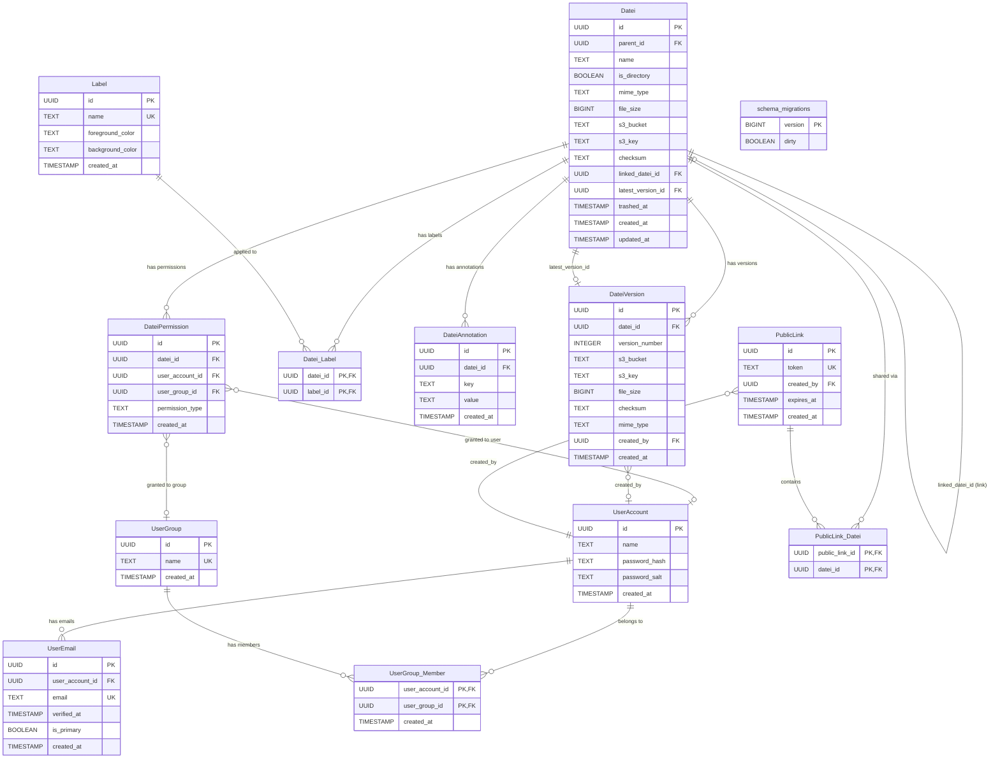

# Datei Database Schema

## ER Diagram



## ASCII Schema

```
┌──────────────────────────────────────┐       ┌──────────────────────────────────────┐
│ UserAccount                          │       │ UserGroup                            │
├──────────────────────────────────────┤       ├──────────────────────────────────────┤
│ id             UUID           PK     │       │ id             UUID           PK     │
│ name           TEXT           NOT NULL│       │ name           TEXT           UNIQUE  │
│ password_hash  TEXT           NOT NULL│       │ created_at     TIMESTAMP             │
│ password_salt  TEXT           NOT NULL│       └──────────┬───────────────────────────┘
│ created_at     TIMESTAMP             │                  │
└──┬──────────┬────────────────────────┘                  │
   │          │                                           │
   │          │  ┌────────────────────────────────────────┐│
   │          │  │ UserGroup_Member                       ││
   │          │  ├────────────────────────────────────────┤│
   │          │  │ user_account_id  UUID  PK,FK ──────────┘│
   │          │  │ user_group_id    UUID  PK,FK ───────────┘
   │          │  │ created_at       TIMESTAMP              │
   │          │  └─────────────────────────────────────────┘
   │          │
   │          │  ┌────────────────────────────────────────┐
   │          └─>│ UserEmail                              │
   │             ├────────────────────────────────────────┤
   │             │ id               UUID       PK         │
   │             │ user_account_id  UUID       FK         │
   │             │ email            TEXT       UNIQUE     │
   │             │ verified_at      TIMESTAMP             │
   │             │ is_primary       BOOLEAN               │
   │             │ created_at       TIMESTAMP             │
   │             └────────────────────────────────────────┘
   │
   │  ┌───────────────────────────────────────────────────────────────────┐
   │  │ Datei                                                            │
   │  ├───────────────────────────────────────────────────────────────────┤
   │  │ id                 UUID       PK                                 │
   │  │ parent_id          UUID       FK -> Datei(id)  [folder tree]     │
   │  │ name               TEXT       NOT NULL                           │
   │  │ is_directory       BOOLEAN    NOT NULL DEFAULT false             │
   │  │ mime_type          TEXT                                          │
   │  │ file_size          BIGINT                                        │
   │  │ s3_bucket          TEXT                                          │
   │  │ s3_key             TEXT                                          │
   │  │ checksum           TEXT                                          │
   │  │ linked_datei_id    UUID       FK -> Datei(id)  [link]            │
   │  │ latest_version_id  UUID       FK -> DateiVersion(id)             │
   │  │ trashed_at         TIMESTAMP  [soft delete / trash]              │
   │  │ created_at         TIMESTAMP                                     │
   │  │ updated_at         TIMESTAMP                                     │
   │  └──┬──────────┬──────────┬──────────┬──────────────────────────────┘
   │     │          │          │          │
   │     │          │          │          │  ┌─────────────────────────────────────┐
   │     │          │          │          └─>│ DateiVersion                        │
   │     │          │          │             ├─────────────────────────────────────┤
   │     │          │          │             │ id              UUID       PK       │
   │     │          │          │             │ datei_id        UUID       FK       │
   │     │          │          │             │ version_number  INTEGER             │
   │     │          │          │             │ s3_bucket       TEXT       NOT NULL  │
   │     │          │          │             │ s3_key          TEXT       NOT NULL  │
   │     │          │          │             │ file_size       BIGINT     NOT NULL  │
   │     │          │          │             │ checksum        TEXT       NOT NULL  │
   │     │          │          │             │ mime_type       TEXT       NOT NULL  │
   │     │          │          │             │ created_by      UUID       FK -> UserAccount │
   │     │          │          │             │ created_at      TIMESTAMP           │
   │     │          │          │             │ UNIQUE(datei_id, version_number)    │
   │     │          │          │             └─────────────────────────────────────┘
   │     │          │          │
   │     │          │          │  ┌─────────────────────────────────────┐
   │     │          │          └─>│ DateiAnnotation                    │
   │     │          │             ├─────────────────────────────────────┤
   │     │          │             │ id          UUID       PK           │
   │     │          │             │ datei_id    UUID       FK           │
   │     │          │             │ key         TEXT       NOT NULL     │
   │     │          │             │ value       TEXT       NOT NULL     │
   │     │          │             │ created_at  TIMESTAMP              │
   │     │          │             │ UNIQUE(datei_id, key)              │
   │     │          │             └─────────────────────────────────────┘
   │     │          │
   │     │          │  ┌─────────────────────────────────────────────────────┐
   │     │          └─>│ DateiPermission                                     │
   │     │             ├─────────────────────────────────────────────────────┤
   │     │             │ id               UUID    PK                         │
   │     │             │ datei_id         UUID    FK                         │
   │     │             │ user_account_id  UUID    FK -> UserAccount(id)      │
   │     │             │ user_group_id    UUID    FK -> UserGroup(id)        │
   │     │             │ permission_type  TEXT    owner|read_write|read_only │
   │     │             │ created_at       TIMESTAMP                          │
   │     │             │ CHECK: exactly one of user/group is NOT NULL        │
   │     │             │ UNIQUE owner per datei (partial index)              │
   │     │             └─────────────────────────────────────────────────────┘
   │     │
   │     │  ┌────────────────────────────────────┐     ┌──────────────────────────────┐
   │     └─>│ Datei_Label                        │     │ Label                        │
   │        ├────────────────────────────────────┤     ├──────────────────────────────┤
   │        │ datei_id  UUID  PK,FK              │────>│ id                UUID    PK │
   │        │ label_id  UUID  PK,FK              │     │ name              TEXT  UNIQUE│
   │        └────────────────────────────────────┘     │ foreground_color  TEXT        │
   │                                                   │ background_color  TEXT        │
   │                                                   │ created_at        TIMESTAMP   │
   │                                                   └──────────────────────────────┘
   │
   │  ┌──────────────────────────────────┐     ┌────────────────────────────────────┐
   └─>│ PublicLink                       │     │ PublicLink_Datei                   │
      ├──────────────────────────────────┤     ├────────────────────────────────────┤
      │ id          UUID       PK        │<────│ public_link_id  UUID  PK,FK        │
      │ token       TEXT       UNIQUE    │     │ datei_id        UUID  PK,FK -> Datei │
      │ created_by  UUID       FK        │     └────────────────────────────────────┘
      │ expires_at  TIMESTAMP            │
      │ created_at  TIMESTAMP            │
      └──────────────────────────────────┘

┌──────────────────────────────┐
│ schema_migrations            │
│ (managed by go-migrate)      │
├──────────────────────────────┤
│ version  BIGINT  PK          │
│ dirty    BOOLEAN             │
└──────────────────────────────┘
```

## Design Notes

### Naming Convention

- **Entity tables**: `CamelCase` (e.g. `UserAccount`, `Datei`, `Label`)
- **Relation/join tables**: `CamelCase_CamelCase` with underscore separator (e.g. `Datei_Label`, `PublicLink_Datei`, `UserGroup_Member`)
- **Indexes**: `idx_TableName_column` / `uq_TableName_name`
- **Constraints**: `ck_TableName_name` / `fk_TableName_name`

Note: PostgreSQL lowercases unquoted identifiers, so `UserAccount` is stored as `useraccount` in the catalog. The CamelCase is preserved in the SQL source for readability.

### ID Strategy

All entity tables use `UUID` primary keys with `uuidv7()` (requires PostgreSQL 18+).
UUIDv7 embeds a timestamp in the first 48 bits, making IDs time-ordered. This significantly
improves B-tree index locality, reduces page splits, and provides better insert performance
compared to random UUIDv4 while still avoiding enumerable IDs.

### Folder Hierarchy

Uses the **adjacency list** pattern (`parent_id` self-referencing FK). This is the simplest
model and performs well with PostgreSQL `WITH RECURSIVE` CTEs for breadcrumb and subtree queries.
`ON DELETE CASCADE` means deleting a folder recursively removes all contents.

### Links

A Datei can be a **link** to another Datei via `linked_datei_id`. Links have their own
permissions and metadata but reference the target's file content. If the target is deleted,
`linked_datei_id` is set to NULL (broken link), which the application should handle gracefully.

### Versioning

Each Datei can have multiple `DateiVersion` rows. The `latest_version_id` on the Datei table
points to the current version for fast lookups without querying the version table.
The circular FK dependency is resolved by creating the Datei table first, then adding the
FK constraint via `ALTER TABLE` after `DateiVersion` exists.

### Permissions

The `DateiPermission` table uses a **polymorphic grantee** pattern: each row references either
a `user_account_id` OR a `user_group_id` (enforced by a CHECK constraint). Permission types
use `TEXT` with a `CHECK` constraint rather than a PostgreSQL `ENUM`, since enums are difficult
to modify after creation.

Key constraints:
- **Single owner**: A partial unique index ensures at most one `owner` permission per Datei
- **No duplicates**: Unique indexes prevent granting the same user or group multiple permissions on the same Datei
- **Grantee required**: A CHECK constraint ensures exactly one of user/group is set

### Soft Delete (Trash)

The `trashed_at` timestamp on `Datei` supports a trash/recycle bin. Items with `trashed_at IS NULL`
are active; items with a timestamp are in trash. A partial index on `trashed_at` optimizes
listing trashed items. Application queries should filter on `WHERE trashed_at IS NULL` by default.

### Labels and Annotations

- **Labels** have globally unique names and customizable foreground/background colors.
  The many-to-many `Datei_Label` relation table allows any Datei to have multiple labels.
- **Annotations** are key-value pairs per Datei. The `UNIQUE(datei_id, key)` constraint
  ensures each key appears at most once per Datei.

### Public Links

Token-based sharing via `PublicLink`. Each link has a unique token, optional expiration,
and references multiple Dateis through the `PublicLink_Datei` relation table.

### User Emails

Users can have multiple email addresses (`UserEmail` table). The `is_primary` flag marks the
main email, enforced to at most one per user via a partial unique index. Each email can be
independently verified via `verified_at`.

### schema_migrations

Managed automatically by [go-migrate](https://github.com/golang-migrate/migrate).
Contains `version` (BIGINT) and `dirty` (BOOLEAN) columns. **Do not create or modify this
table manually** -- go-migrate handles it during `migrate up` / `migrate down`.
